# Paddle Paddle Hackathon（第三期 65）
## **1.任务描述**

随着深度学习等数据驱动方法的快速发展，为科学计算提供了新的解决方案。近三年来，学者们进一步从数据和知识融合的角度出发，充分挖掘数据内蕴规律与物理第一性原理，以期实现无网格的、无限分辨率的物理过程的求解、预测、辨识和重构等更加灵活的任务，其中 **Physics informed neural networks(PINNs)** 在损失函数中引入了物理守恒正则项，可以灵活处理偏微分方程求解的正问题和反问题，相关工作也是AI for Science领域中的一个研究热点。

**非定常圆柱绕流** 是计算流体力学（CFD）中的基础问题，在很多相关工作中作为模型的验证算例。但是，在大多数的PINN模型中，或仅考虑部分计算域或无法实现完全的无监督（在非边界条件和初始条件中的局部测点补充了流场信息，如下表所示）。

|    文献                  | 效果                             | 求解全部计算域 | 完全无监督   |
| ----------------------  | ---------------------------------| ------------ | ---------- |
| Raissi M, et al    [6]  | 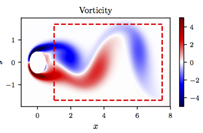  | 否           | 是         |
| Raissi M, et al    [7]  |   | 否           | 是         |
| Raissi M, et al    [8]  | 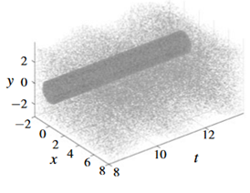  | 是           | 否         |
| Cai S, et al    [9]     | 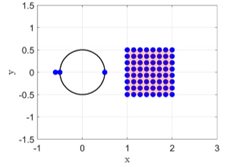  | 是           | 否         |
| Jin X, et al    [10]    | 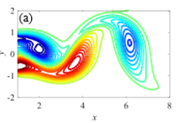 | 否           | 是         |

本任务中，作者在 **PaddleScience** 的 2D 非定常圆柱绕流 Demo 的基础上，完成了以下任务：
- 探讨了2D 非定常圆柱绕流的物理场预测任务中的监督测点数量和位置分布的影响；
- 将2D 非定常圆柱绕流的物理场预测任务中的200-300个的监督数据降低到了30个点以内；
- 研究了极端情况下，仅以10个以内的圆柱壁面测点作为监督数据时，本模型物理场预测能力。

## 2.代码描述
### 2.1 代码说明
1. [PINNs_Cylinder AI studio](https://aistudio.baidu.com/aistudio/projectdetail/4501565)相关运行结果

  - run_train_pdpd.py   为训练主程序
  - run_tvalidate_pdpd.py  为验证主程序
  - basic_model_pdpd.py  为本问题所涉及到的基础全连接网络,
  - visual_data.py  为数据可视化
  - process_data_pdpd.py  为数据预处理

  - **work文件夹**中为模型训练过程及验证可视化
    - \train  训练集数据 & 训练过程的可视化
    - \validation 验证数据的可视化
    - train.log 所有训练过程中的日志数据保存
    - valida.log 所有训练过程中的日志数据保存
    - latest_model.pth 模型文件
    
  - **data文件夹**中为非定常2D圆柱绕流数据，可从以下链接获取
链接：https://pan.baidu.com/s/1RtBQaEzZQon0cxSzmau7kg 
提取码：0040


### 2.2 环境依赖
  > numpy == 1.22.3 \
  > scipy == 1.8.0  \
  > paddlepaddle-gpu == 2.3.2 \
  > paddle==2.3.2 \
  > matplotlib==3.5.1 \


## 3.数据集说明


该数据集为Re=250时的二维层流圆柱绕流数值计算结果，包括了压力场 *p*、*x*方向速度场 *u* 和*y*方向速度场 *v* 在一个周期内共120个时间切片，该问题的Navier-Stokes控制方程可表示为

$$
\frac{\partial u}{\partial x} + \frac{\partial v}{\partial y} = 0 
$$

$$
\frac{\partial u}{\partial t} + u\frac{\partial u}{\partial x} + v\frac{\partial u}{\partial y} = -\frac{1}{\rho}\frac{\partial p}{\partial x} + \frac{\mu}{\rho}(\frac{\partial ^2 u}{\partial x ^2} + \frac{\partial ^2 u}{\partial y ^2})
$$

$$
\frac{\partial v}{\partial t} + u\frac{\partial v}{\partial x} + v\frac{\partial v}{\partial y} = -\frac{1}{\rho}\frac{\partial p}{\partial y} + \frac{\mu}{\rho}(\frac{\partial ^2 v}{\partial x ^2} + \frac{\partial ^2 v}{\partial y ^2})
$$

该圆柱（直径为c=1.0m）绕流问题的计算域以及相应边界条件如下图所示：本模型所文献[1]采用的直径约64c的同心圆形域，入口边界为速度入口（ $u=U_0,v=0$ ）,其中 $U_0=1m/s$ ，出口边界为出流边界，即速度在边界上符合（ $\partial u/ \partial\vec{\bf{n}}=0,\partial v/ \partial\vec{\bf{n}}=0$ ），圆柱表面为无滑移边界条件。在数值计算中采用标准的物理场初始化方法（ $u=U_0,v=0,p=0$ ），采用SIMPLE算法耦合压力-速度项，二阶和二阶迎风算法空间离散压力和动量项，二阶隐式进行时间离散。工质物性设置为 $\rho=1,U_0=1$ ，而 $\mu$ 由Re=250决定，此时，该工况的控制方程可简便的无量纲化，无量纲方法为：

$$
x^*=x/c, y^*=y/c, u^*=u/U_0, v^*=v/U_0, p^*=\frac{p}{\rho c U_0^2}
$$

但是为了方便表示仍采用原本的符号表示，无量纲控制方程为：

$$
eq_1 :\frac{\partial u}{\partial x} + \frac{\partial v}{\partial y} = 0 
$$

$$
eq_2 :\frac{\partial u}{\partial t} + u\frac{\partial u}{\partial x} + v\frac{\partial u}{\partial y} + \frac{\partial p}{\partial x} - \frac{1}{Re}(\frac{\partial ^2 u}{\partial x ^2} + \frac{\partial ^2 u}{\partial y ^2}) = 0
$$

$$
eq_3 :\frac{\partial v}{\partial t} + u\frac{\partial v}{\partial x} + v\frac{\partial v}{\partial y} +\frac{\partial p}{\partial y} -\frac{1}{Re}(\frac{\partial ^2 v}{\partial x ^2} + \frac{\partial ^2 v}{\partial y ^2})
$$

paddle 实现代码如下：
```python
class Net_single(DeepModel_single):  
    def __init__(self, planes, data_norm):  
        super(Net_single, self).__init__(planes, data_norm, active=nn.Tanh())  
        self.Re = 250.  
  
    def equation(self, inn_var, out_var):  
        # a = grad(psi.sum(), in_var, create_graph=True, retain_graph=True)[0]  
        p, u, v = out_var[:, 0:1], out_var[:, 1:2], out_var[:, 2:3]  
  
        duda = gradients(u, inn_var)  
        dudx, dudy, dudt = duda[:, 0:1], duda[:, 1:2], duda[:, 2:3]  
        dvda = gradients(v, inn_var)  
        dvdx, dvdy, dvdt = dvda[:, 0:1], dvda[:, 1:2], dvda[:, 2:3]  
        d2udx2 = gradients(dudx, inn_var)[:, 0:1]  
        d2udy2 = gradients(dudy, inn_var)[:, 1:2]  
        d2vdx2 = gradients(dvdx, inn_var)[:, 0:1]  
        d2vdy2 = gradients(dvdy, inn_var)[:, 1:2]  
        dpda = gradients(p, inn_var)  
        dpdx, dpdy = dpda[:, 0:1], dpda[:, 1:2]  
  
        eq1 = dudt + (u * dudx + v * dudy) + dpdx - 1 / self.Re * (d2udx2 + d2udy2)  
        eq2 = dvdt + (u * dvdx + v * dvdy) + dpdy - 1 / self.Re * (d2vdx2 + d2vdy2)  
        eq3 = dudx + dvdy  
        eqs = paddle.concat((eq1, eq2, eq3), axis=1)  
        return eqs
```

边界条件的数学表达式为

| 边界条件 | 公式 |
| :----------------------------------------------------------: | :---------------------------------------------------------: |
| 入口边界    |   $bq_1: u-U_0=0; bq_2: v=0$ |
| 出口边界    |  $bq_3: \frac{\partial u}{\partial\vec{\bf{n}}}=0; bq_4: \frac{\partial v}{\partial\vec{\bf{n}}}=0$ |
| 圆柱壁面边界 |  $bq_5:  u=0; bq_6:  v=0$ |
| 初始边界条件 | $in_1:  {u- u_{initial}}=0;in_2:  v- v_{initial}=0;in_3:  p- p_{initial}=0$ |


| 计算域示意图 | 网格划分示意图 |
| ------- | -----|
| 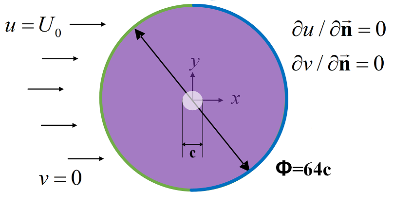 | 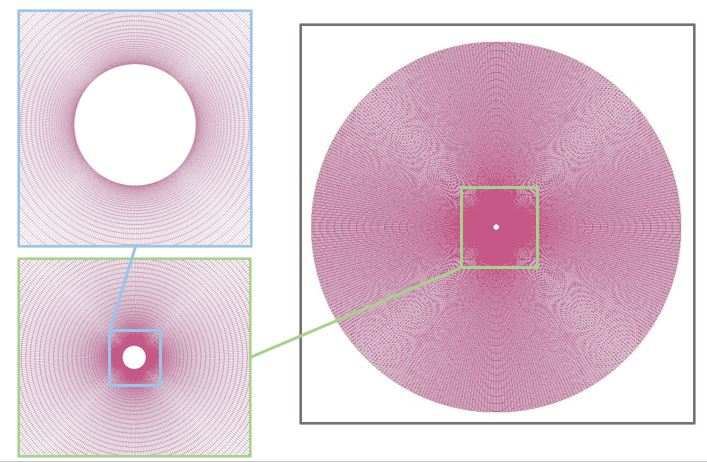 |

考虑的气动性能参数包括刚体表面的受力，即y方向上的升力和x方向上的阻力，这些性能参数可以表示为物理场在圆柱表面的积分形式：

$$
\vec{F}(t)= [F_x(t), F_y(t)]^T= \oint{(-p \vec{\bf{n}}+\frac{\mu}{\rho}(\nabla \vec{\bf{u}}+ \nabla \vec{\bf{u}}^T) \cdot \vec{\bf{n}})ds}
$$

对应的升力和阻力系数可表示为：

$$
C_l=\frac{F_x}{\frac{1}{2}\rho c U_0^2}, C_d=\frac{F_y}{\frac{1}{2}\rho c U_0^2}
$$

为了验证圆柱绕流数值计算的准确性，下图展示了升力系数和阻力系数与其他研究的对比。由图可知，在 Re=60～500范围内，本文所采用的数值计算方法得到的系数与文献[1-5]的研究基本吻合，验证了本算例所采用的Re = 250 的计算精度。

| 阻力系数曲线 | 升力系数曲线 |
| ---- | -----|
| 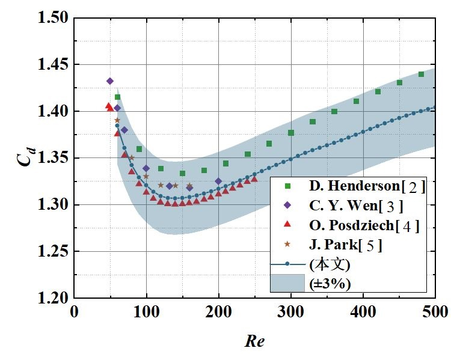 |  |

数据读入见代码：
```python
def read_data():  
    data = h5py.File('./data/cyl_Re250.mat', 'r')  
  
    nodes = np.array(data['grids_']).squeeze().transpose((3, 2, 1, 0)) # [Nx, Ny, Nf]  
    field = np.array(data['fields_']).squeeze().transpose((3, 2, 1, 0)) # [Nt, Nx, Ny, Nf]  
    times = np.array(data['dynamics_']).squeeze().transpose((1, 0))[3::4, (0,)] # (800, 3) -> (200, 1)  
    nodes = nodes[0]  
    times = times - times[0, 0]  
  
    return times[:120], nodes[:, :, 1:], field[:120, :, :, :]  
```

## 4.模型描述

本模型采用常规的 Physics informed neural network (PINN) 模型， 以每个采样点的时空坐标为输入，物理场为输出，该模型的数学表达式为

$$
f(t,x,y)= [p,u,v]^T
$$

综合的损失函数为监测点损失、控制方程损失和所有的边界条件损失：

$$
综合损失： L_{tol}= w_1 L_{sup} +  w_2 L_{eq} +  w_3 L_{bq} +  w_4 L_{in}
$$

$$
监督点损失： L_{sup}=\frac{1}{n_{sup}}\sum_{i=1}^{n_{sup}}{sqrt(({\bf{f}}_{sup}^i - \hat{\bf{f}}_{sup}^i)^2)}
$$

$$
控制方程损失： L_{eq}=\frac{1}{n_{eq}}\sum_{i,j=1}^{i,j=n_{eq},3}{sqrt({{\bf{eq}}_{j}^{i}}^2)}
$$

$$
边界条件损失： L_{bq}=\frac{1}{n_{bq}}\sum_{i,j=1}^{i,j=n_{bq},6}{sqrt({{\bf{bq}}_{j}^{i}}^2)}
$$

$$
初始条件损失： L_{in}=\frac{1}{n_{in}}\sum_{i,j=1}^{i,j=n_{in},3}{sqrt({{\bf{in}}_{j}^{i}}^2)}
$$

需要注意的是，由于该数据集仅采用了稳定后的一个周期内的物理场，因此初始边界损失中的物理场应为周期中初始时刻的物理场。

**模型的详细参数和训练方法总结如下**：
* 本模型共采用6层全连接层，每层各由64个神经元，输入层为3（t、x、y），输出层为3，对应物理场p、u、v；

``` python
parser.add_argument('--Layer_depth', default=5, type=int, help="Number of Layers depth")  
parser.add_argument('--Layer_width', default=64, type=int, help="Number of Layers width")
```

* 考虑该物理场为无量纲化的结果，所以损失函数权重固定为 $w_1=1.0, w_2=1.0, w_3=1.0, w_4=1.0$ 即可
* 采用Adam优化器，初始学习率为0.001
* 共训练400,000个迭代步，学习率分别在总步数的80%和90%时衰减为之前的0.1


**各损失函数的采样点总结如下**：
* 训练过程的采样点直接采用有限体积方法的网格节点

  训练过程中每步计算随机选取10个时间步上各30000个网格节点进行控制方程损失计算。
  
```python
  inn = BCs[0].sampling(Nx=opts.Nx_EQs, Nt=opts.Nt_EQs)  #随机抽取守恒损失计算点  
```

* 边界条件采样点

  训练过程中每步计算随机选取20个时间步上进口、出口以及圆柱壁面的网格节点进行边界条件损失计算。
  
```python
BC_in = BCs[1].sampling(Nx='all', Nt=opts.Nt_BCs) #入口  
BC_out = BCs[2].sampling(Nx='all', Nt=opts.Nt_BCs) #出口  
BC_wall = BCs[3].sampling(Nx='all', Nt=opts.Nt_BCs)  #圆柱  
```

* 初始条件采样点

  训练过程中选取初始时刻所有网格节点进行初始条件损失计算。
  
```python
IC_0 = ICs[0].sampling(Nx='all')  #初始场
```

* 监测点生成：

  本模型监测点布置于尾迹区域、来流区域以及圆柱壁面圆周，其中圆柱壁面圆周监测点为靠近壁面的第一个网格节点。其生成由函数 *BCS_ICS(nodes, points)* 给出，而  采样方式与边界条件类似：
  
```python
BC_meas = BCs[4].sampling(Nx='all', Nt=opts.Nt_BCs)
```

  设置了10组不同个数监测点进行学习对比，具体监测点布置个数及位置总结如下：

| 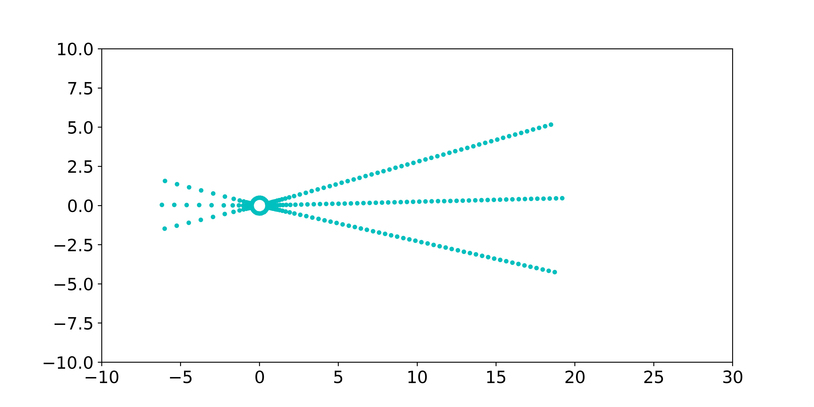**192+48+32（尾迹区+来流区+圆柱壁面)** | **240+32（尾迹区+圆柱壁面)**  |
| :----------------------------------------------------------: | :---------------------------------------------------------: |
| **96+24+16（尾迹区+来流区+圆柱壁面)** | **120+16（尾迹区+圆柱壁面)** |
| **48+12+8（尾迹区+来流区+圆柱壁面)** |   **60+8（尾迹区+圆柱壁面)**   |
| **24+6+4（尾迹区+来流区+圆柱壁面)** |   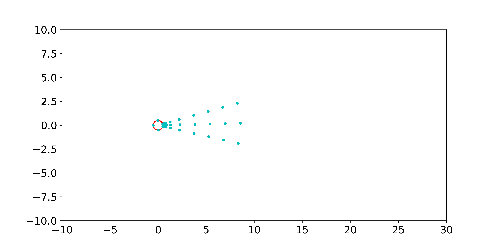**30+4（尾迹区+圆柱壁面)**   |
|   **12+4（尾迹区+圆柱壁面)**    |        **4（圆柱壁面)**         |


## 5.结果
物理场预测精度采用相对 $L_2$ 误差 表示，计算公式为
$$ L_2 = \sum_{i,j=1,1}^{n,3}{\frac{|{\bf{f}}^i_j - \hat{\bf{f}}^i_j|_2^2}{|{\bf{f}}^i_j|_2^2}} $$
其中， *j* =1,2,3 分别表示p,u,v三个物理场，而 *i* 表示网格节点编号。 

### 5.1 监测点位置及数量
在监督测点数量相同的情况下，尾迹区+来流区+圆柱壁面的组合监督测点分布整体预测效果较好，而尾迹区+圆柱壁面的组合监督测点分布模型在来流区的预测效果较差，因此，可优先考虑采用尾迹区+来流区+圆柱壁面的监督测点分布方式。

|                                  | 尾迹区+来流区+圆柱壁面 (196+48+32)  | 尾迹区+圆柱壁面 (240+32) |
| -------------------------------- | -------------------------------- | ---------------------------- |
| 物理场相对 $L_2$ 误差               | 0.021                           | 0.034                       |
| 预测物理场                         |  |  |
| 升力 $C_l$ & 阻力 $C_d$            |  |  |

随着监督测点数量的增加，物理场和气动参数（升力与阻力）预测精度更高。当监督测点数量降至30左右时，尾迹区+来流区+圆柱壁面(24+6+4)的相对$L_2$ 误差与尾迹区+圆柱壁面 (240+32)相当，而尾迹区+圆柱壁面 (30+4)稍有增加。该结果表明了本模型对于少量监督测点的物理场预测依然保持较高的准确率。

|                                  | 尾迹区+来流区+圆柱壁面 (24+6+4)  | 尾迹区+圆柱壁面 (30+4) |
| -------------------------------- | -------------------------------- | ---------------------------- |
| 物理场相对 $L_2$ 误差               | 0.035                            | 0.041                       |
| 预测物理场                         |  |  |
| 升力 $C_l$ & 阻力 $C_d$            |  |  |


### 5.2目标工况（少量监测点）

本模型的主要任务为将监督测点的数量降至20-30，下表共展示了两种监督测点分布，总测点数量分别为34和16。

|                                  | 尾迹区+来流区+圆柱壁面 (24+6+4)  | 尾迹区+圆柱壁面 (12+4) |
| -------------------------------- | -------------------------------- | ---------------------------- |
| 物理场相对 $L_2$ 误差               | 0.035                            | 0.046                       |
| 预测物理场                         | 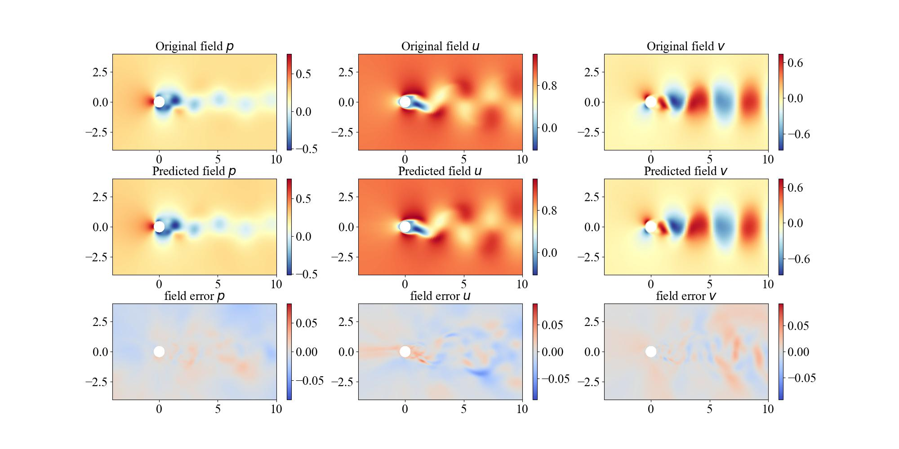 | 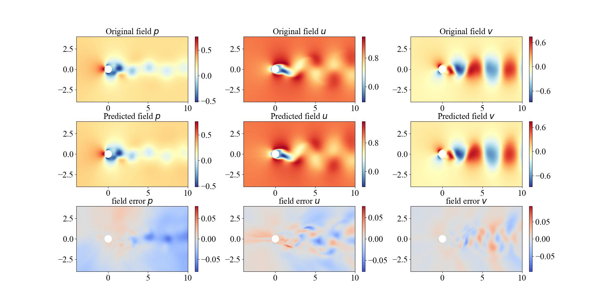 |
| 升力 $C_l$ & 阻力 $C_d$            |  |  |


### 5.3 极端情况（极少圆柱壁面监测点）
考虑一种极端情况，即仅在圆柱壁面布置测点，且测点数量少于10。下表展示了以8和4个圆柱壁面测点为监督数据的物理场预测情况。

|                                  | 圆柱壁面 (8)                      | 圆柱壁面 (4)                     | 
| -------------------------------- | -------------------------------- |-------------------------------- |
| 物理场相对 $L_2$ 误差              | 0.083                            |0.103                            | 
| 预测物理场                         |   | 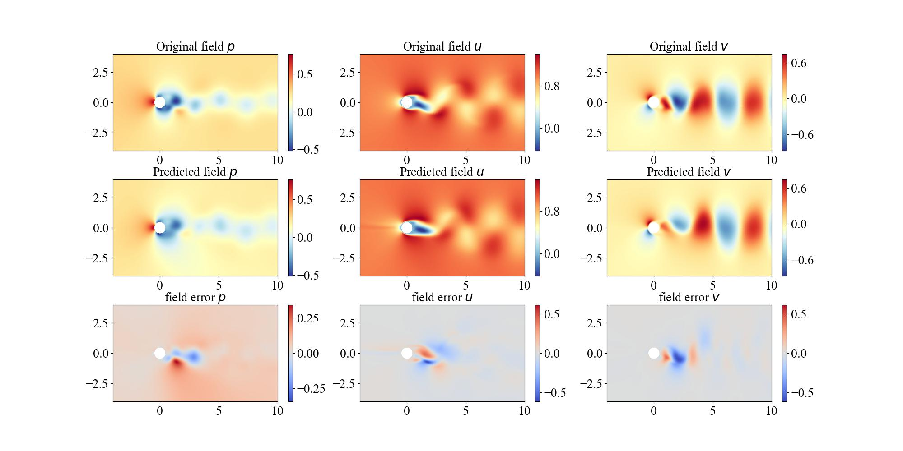 |
| 升力 $C_l$ & 阻力 $C_d$            | 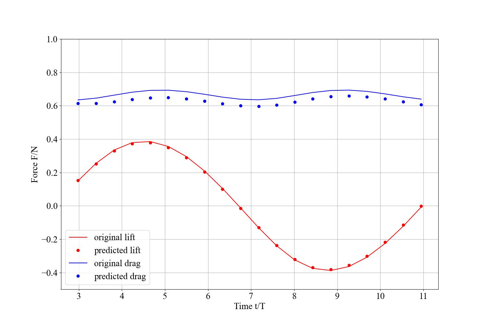  |  |


## 6. 存在问题
* 虽然本模型将监督测点的数量降至4个，但是仍未达到完全无监督（不引入任除边界条件初始条件以外的任意点的物理场信息），有待进一步改进
* 在训练过程中，初始条件损失和NS守恒损失训练过程中不均衡，导致整体训练过程缓慢，猜测是非定常物理场训练依赖于初始值，采用连续时间描述不合理
* 在pytorch框架模型的测试结果表明，gelu()激活函数可有效提高预测精度，但是在paddle框架下暂不支持该函数的高阶微分
* 动态图下的Paddle模型训练时间相比于pytorch更长，大约为pytorch的2-3倍

## 7.模型信息

训练过程中的图片保存在work文件夹下对应保存路径的train文件夹中，训练过程的日志数据保存在train.log中，最新模型保存在latest_model.pth中，测试结果的图片保存在对应保存路径的validation文件夹中，测试结果的日志数据保存在valid.log中。

| 信息          | 说明                                                         |
| ------------- | ------------------------------------------------------------ |
| 发布者        | tianshao1992                                                 |
| 时间          | 2022.9                                                       |
| 框架版本      | Paddle 2.3.2                                                 |
| 应用场景      | 科学计算                                                     |
| 支持硬件      | CPU、GPU                                                     |
| AI studio地址 | [PINNs_Cylinder AI studio](https://aistudio.baidu.com/aistudio/projectdetail/4501565) |


[1]: R. Franke, W. Rodi, and B. Schönung, “Numerical calculation of laminar vortex-shedding flow past cylinders,” _J. Wind Eng. Ind. Aerodyn._, vol. 35, pp. 237–257, Jan. 1990, doi: 10.1016/0167-6105(90)90219-3

[2]: R. D. Henderson, “Details of the drag curve near the onset of vortex shedding,” _Phys. Fluids_, vol. 7, no. 9, pp. 2102–2104, 1995, doi: 10.1063/1.868459.

[3]: C. Y. Wen, C. L. Yeh, M. J. Wang, and C. Y. Lin, “On the drag of two-dimensional flow about a circular cylinder,” _Phys. Fluids_, vol. 16, no. 10, pp. 3828–3831, 2004, doi: 10.1063/1.1789071.

[4]:   O. Posdziech and R. Grundmann, “A systematic approach to the numerical calculation of fundamental quantities of the two-dimensional flow over a circular cylinder,” _J. Fluids Struct._, vol. 23, no. 3, pp. 479–499, 2007, doi: 10.1016/j.jfluidstructs.2006.09.004.

[5]:   J. Park and H. Choi, “Numerical solutions of flow past a circular cylinder at reynolds numbers up to 160,” _KSME Int. J._, vol. 12, no. 6, pp. 1200–1205, 1998, doi: 10.1007/BF02942594.

[6]:  Raissi M. Deep Hidden Physics Models: Deep Learning of Nonlinear Partial Differential Equations[J]. arXiv:1801.06637 [cs, math, stat], 2018.

[7]:  Raissi M, Perdikaris P, Karniadakis G E. Physics-informed neural networks: A deep learning framework for solving forwardand inverse problems involving nonlinear partial differential equations[J].Journal of Computational Physics, 2019, 378: 686–707.

[8]:   Raissi M, Wang Z, Triantafyllou M S, et al.Deep learning of vortex-induced vibrations[J]. Journal of Fluid Mechanics,2019, 861: 119–137.

[9]:  Cai S, Wang Z, Wang S, et al. Physics-Informed Neural Networks for HeatTransfer Problems[J]. Journal of Heat Transfer, 2021, 143(6): 060801.

[10]:  Jin X, Cai S, Li H, et al. NSFnets (Navier-Stokes flow nets):Physics-informed neural networks for the incompressible Navier-Stokesequations[J]. Journal of Computational Physics, 2021, 426: 109951.

